# ♻️ DIU Recycle

DIU Recycle is a Flutter-based mobile application designed to facilitate buying and selling used products among students of Daffodil International University (DIU). The platform promotes sustainability and convenience by connecting buyers and sellers within the university community.

---

## 🚀 Features

- User authentication with university email (Firebase)
- Create, browse, and search listings of used products
- Upload product images and details
- Contact sellers directly
- Notifications for new listings and meessages
- Responsive Flutter UI for Android devices

---

## 🛠️ Tech Stack

- Flutter & Dart
- Firebase Authentication
- Firebase Firestore (Cloud Database)
- Cloudinary (for images)
- OneSignal (Notification)

---

## 📱 Screenshots

  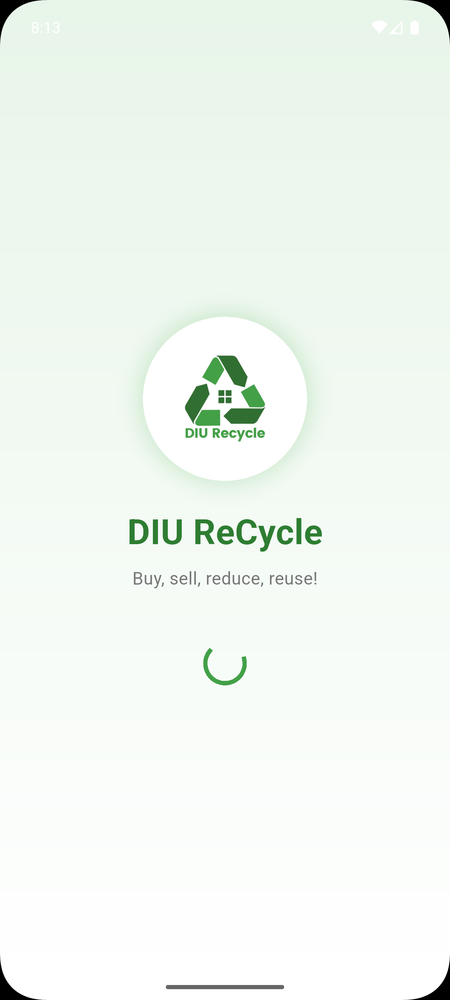
  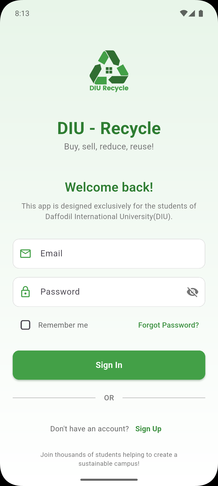
  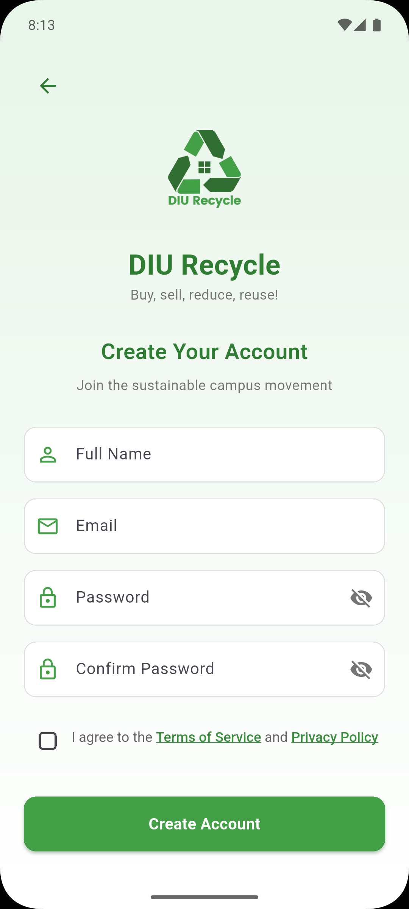
  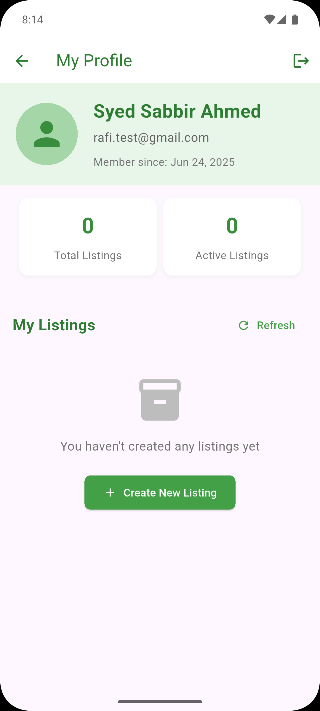

  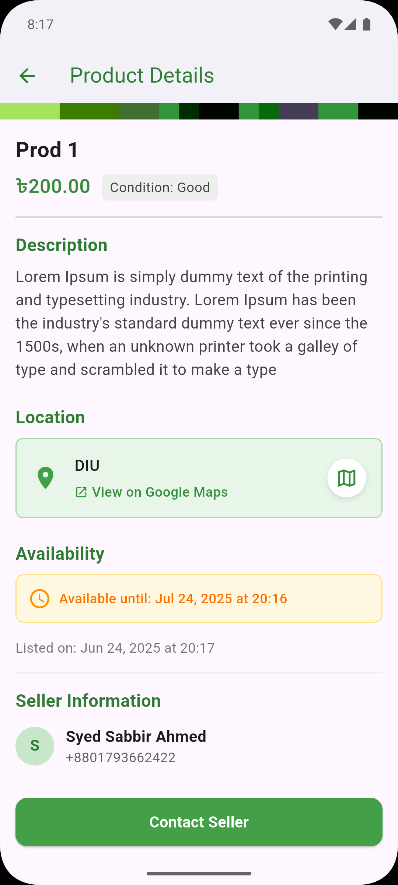
  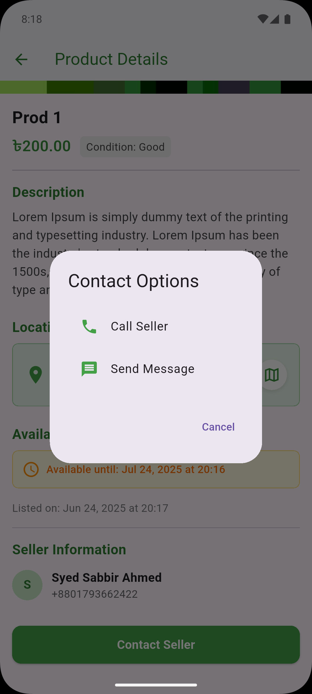
  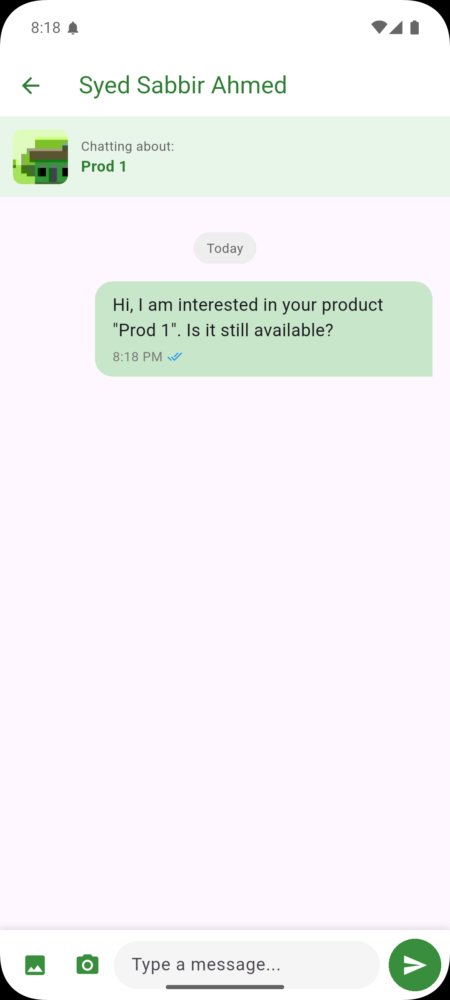
  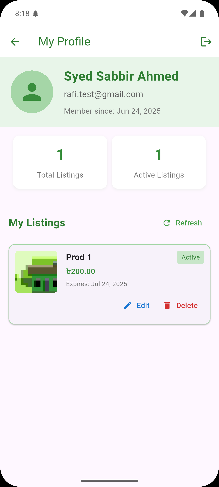

  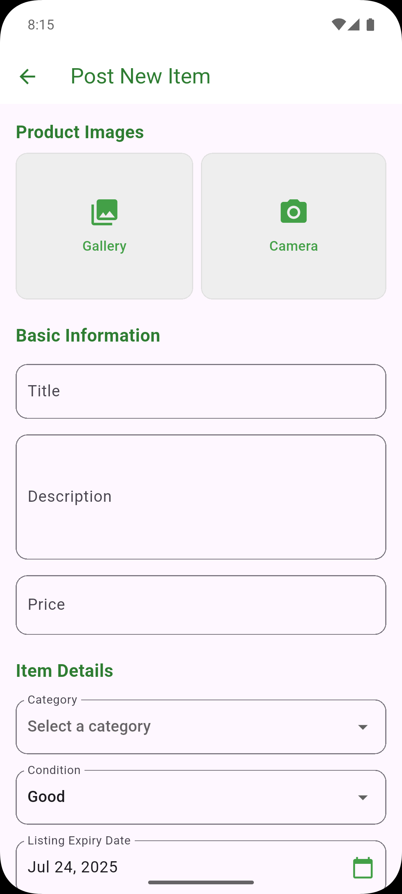
  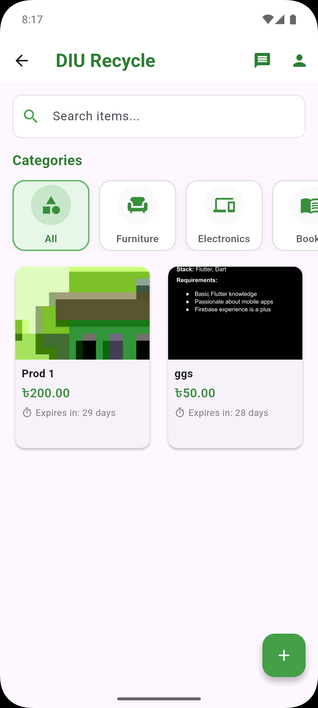
  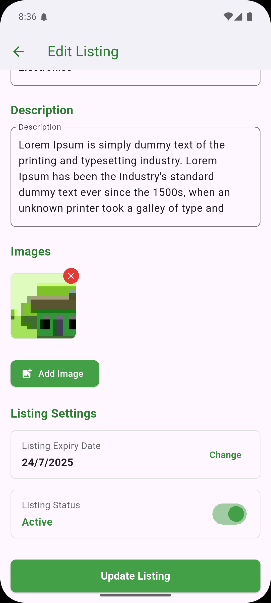
  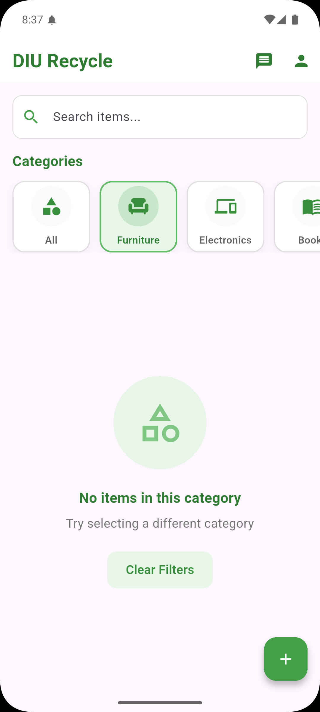

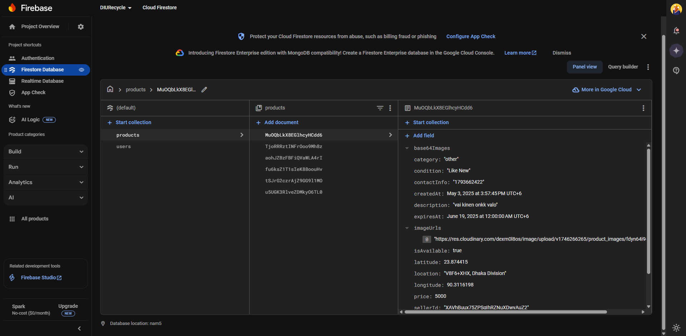
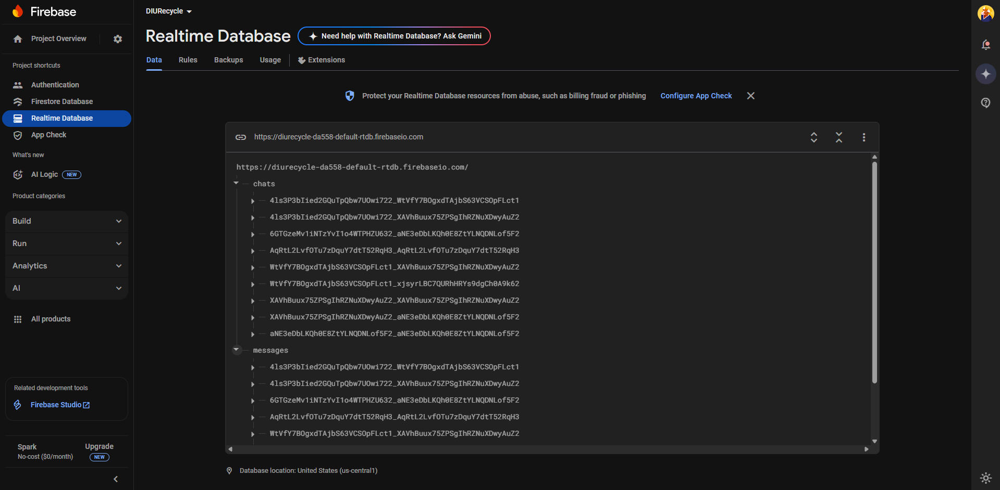

---

## 📞 Contact

If you have any questions, feedback, or want to collaborate, feel free to reach out!

- **Name:** Syed Sabbir Ahmed  
- **Email:** [syedsabbirahmed.contact@gmail.com](mailto:syedsabbirahmed.contact@gmail.com)  
- **GitHub:** [github.com/syedsabbir-git](https://github.com/syedsabbir-git)  
- **LinkedIn:** [linkedin.com/in/syed-sabbir-ahmed](https://www.linkedin.com/in/syed-sabbir-ahmed/) 

